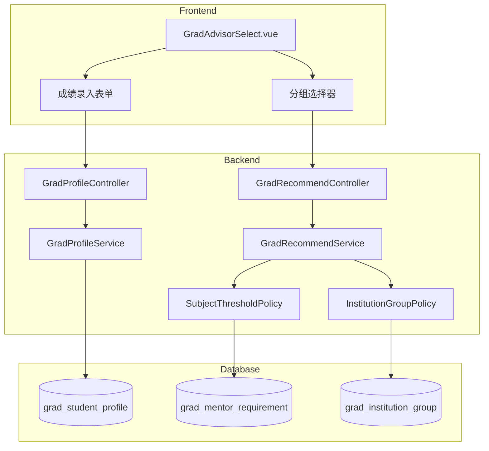
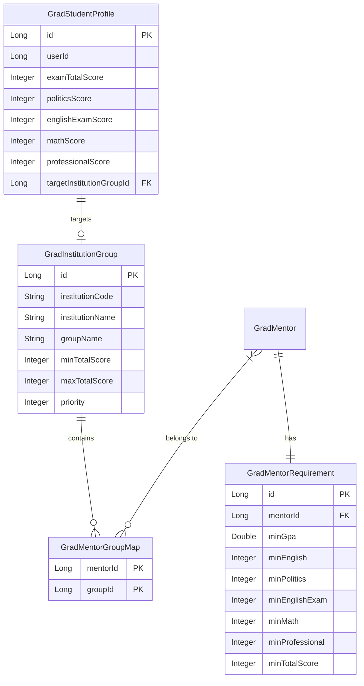

# Design Document

## Overview

本设计文档描述研究生择导模块的考研成绩要求功能扩展。该功能允许学生录入初试成绩（总分和各科目分数），导师设置各科目最低分要求，系统根据成绩进行匹配筛选。特别针对中科院等机构，支持根据成绩进行研究所分组推荐。

## Architecture



## Components and Interfaces

### 1. 数据层扩展

#### 1.1 学生画像扩展 (GradStudentProfile)

新增字段：
- `examTotalScore`: Integer - 初试总分 (0-500)
- `politicsScore`: Integer - 政治成绩 (0-100)
- `englishExamScore`: Integer - 英语成绩 (0-100)，区别于现有的 `englishScore`（英语水平证书分数）
- `mathScore`: Integer - 数学成绩 (0-150)
- `professionalScore`: Integer - 专业课成绩 (0-150)
- `targetInstitutionGroupId`: Long - 目标机构分组ID（可选）

#### 1.2 导师要求扩展 (GradMentorRequirement)

新增字段：
- `minPolitics`: Integer - 政治最低分
- `minEnglishExam`: Integer - 英语最低分
- `minMath`: Integer - 数学最低分
- `minProfessional`: Integer - 专业课最低分
- `minTotalScore`: Integer - 总分最低分

#### 1.3 新增机构分组表 (GradInstitutionGroup)

```sql
CREATE TABLE grad_institution_group (
  id BIGINT PRIMARY KEY AUTO_INCREMENT,
  institution_code VARCHAR(32) NOT NULL,  -- 机构代码，如 'CAS' 表示中科院
  institution_name VARCHAR(128) NOT NULL, -- 机构名称
  group_name VARCHAR(128) NOT NULL,       -- 分组名称，如 '计算所'、'软件所'
  min_total_score INT NULL,               -- 该分组最低总分要求
  max_total_score INT NULL,               -- 该分组最高总分（用于范围匹配）
  priority INT DEFAULT 0,                 -- 优先级，用于多范围重叠时选择
  description VARCHAR(512) NULL,
  created_at TIMESTAMP DEFAULT CURRENT_TIMESTAMP,
  updated_at TIMESTAMP DEFAULT CURRENT_TIMESTAMP ON UPDATE CURRENT_TIMESTAMP
) ENGINE=InnoDB DEFAULT CHARSET=utf8mb4;

CREATE INDEX idx_gig_inst ON grad_institution_group(institution_code);
CREATE INDEX idx_gig_score ON grad_institution_group(min_total_score, max_total_score);
```

#### 1.4 导师与机构分组关联表 (GradMentorGroupMap)

```sql
CREATE TABLE grad_mentor_group_map (
  mentor_id BIGINT NOT NULL,
  group_id BIGINT NOT NULL,
  PRIMARY KEY (mentor_id, group_id)
) ENGINE=InnoDB DEFAULT CHARSET=utf8mb4;

CREATE INDEX idx_gmgm_group ON grad_mentor_group_map(group_id);
```

### 2. 服务层

#### 2.1 ProfileSaveRequest DTO 扩展

```java
public class ProfileSaveRequest {
    // ... existing fields ...
    
    @Min(0) @Max(500)
    private Integer examTotalScore;
    
    @Min(0) @Max(100)
    private Integer politicsScore;
    
    @Min(0) @Max(100)
    private Integer englishExamScore;
    
    @Min(0) @Max(150)
    private Integer mathScore;
    
    @Min(0) @Max(150)
    private Integer professionalScore;
    
    private Long targetInstitutionGroupId;
}
```

#### 2.2 新增策略类 SubjectThresholdPolicy

```java
public class SubjectThresholdPolicy implements RecommendPolicy {
    @Override
    public void apply(PolicyContext ctx, ScoreAccumulator acc) {
        // 检查各科目是否达到导师门槛
        // 任一科目不达标则 status=unfit，reasons 添加具体原因
    }
}
```

#### 2.3 新增策略类 InstitutionGroupPolicy

```java
public class InstitutionGroupPolicy implements RecommendPolicy {
    @Override
    public void apply(PolicyContext ctx, ScoreAccumulator acc) {
        // 如果目标机构有分组配置，根据学生总分匹配分组
        // 过滤不在匹配分组内的导师
    }
}
```

### 3. 接口层

#### 3.1 机构分组字典接口

```
GET /api/grad/dicts/institution-groups?institutionCode=CAS
Response: {
  status: "ok",
  data: [
    { id: 1, groupName: "计算所", minTotalScore: 380, maxTotalScore: 500 },
    { id: 2, groupName: "软件所", minTotalScore: 360, maxTotalScore: 400 },
    ...
  ]
}
```

#### 3.2 学生分组匹配接口

```
GET /api/grad/institution-groups/match?institutionCode=CAS&totalScore=385
Response: {
  status: "ok",
  data: {
    matchedGroup: { id: 1, groupName: "计算所" },
    alternativeGroups: [{ id: 2, groupName: "软件所" }]
  }
}
```

## Data Models

### Entity Relationship Diagram




## Correctness Properties

*A property is a characteristic or behavior that should hold true across all valid executions of a system-essentially, a formal statement about what the system should do. Properties serve as the bridge between human-readable specifications and machine-verifiable correctness guarantees.*

### Property 1: Score Validation Consistency

*For any* submitted score value and its corresponding score type (total/politics/english/math/professional), the validation result SHALL be `valid` if and only if the score falls within the defined range for that type (total: 0-500, politics/english: 0-100, math/professional: 0-150).

**Validates: Requirements 1.1, 1.2, 1.5, 2.3, 5.2**

### Property 2: Profile Score Round-Trip

*For any* valid set of exam scores (total, politics, english, math, professional), saving the scores to a student profile and then retrieving that profile SHALL return the exact same score values.

**Validates: Requirements 1.3, 1.4**

### Property 3: Mentor Requirement Persistence

*For any* mentor requirement with subject thresholds (minPolitics, minEnglishExam, minMath, minProfessional, minTotalScore), saving the requirement and then retrieving it SHALL return all configured threshold values unchanged.

**Validates: Requirements 2.1, 2.2, 2.4**

### Property 4: Threshold Matching Correctness

*For any* student profile with exam scores and any mentor with subject thresholds, the mentor SHALL be marked as `unfit` if and only if at least one of the student's scores is below the corresponding mentor threshold. The `reasons` list SHALL contain exactly the subjects where the threshold was not met.

**Validates: Requirements 3.1, 3.2, 3.3, 3.4**

### Property 5: Institution Group Assignment

*For any* set of institution groups with non-overlapping score ranges and any student total score, the student SHALL be assigned to exactly one group whose range contains the score, or to no group if the score falls outside all ranges. When ranges overlap, the group with higher priority SHALL be selected.

**Validates: Requirements 4.2, 4.3, 4.4**

### Property 6: Institution Group Persistence and Ordering

*For any* set of institution groups created for an institution, retrieving the groups SHALL return them ordered by `minTotalScore` in descending order, with all fields (groupName, institutionCode, minTotalScore, maxTotalScore) preserved.

**Validates: Requirements 5.1, 5.3**

## Error Handling

### 1. 输入验证错误

| 错误场景 | HTTP Status | Error Code | Message |
|---------|-------------|------------|---------|
| 总分超出范围 | 400 | `invalid_total_score` | 总分必须在0-500之间 |
| 政治/英语分数超出范围 | 400 | `invalid_subject_score` | {科目}分数必须在0-100之间 |
| 数学/专业课分数超出范围 | 400 | `invalid_subject_score` | {科目}分数必须在0-150之间 |
| 分组分数范围无效 | 400 | `invalid_score_range` | 最低分不能大于最高分 |

### 2. 业务逻辑错误

| 错误场景 | HTTP Status | Error Code | Message |
|---------|-------------|------------|---------|
| 机构分组不存在 | 404 | `group_not_found` | 指定的机构分组不存在 |
| 无匹配分组 | 200 | `no_matching_group` | 您的成绩暂无匹配的分组，建议查看其他机构 |
| 成绩信息不完整 | 200 | `incomplete_scores` | 请补充完整的成绩信息以获得更准确的推荐 |

### 3. 推荐结果状态

| 状态 | 含义 | 触发条件 |
|------|------|---------|
| `fit` | 符合条件 | 所有科目成绩均达到导师门槛 |
| `borderline` | 边缘情况 | 成绩接近门槛或部分信息缺失 |
| `unfit` | 不符合条件 | 任一科目成绩低于导师门槛 |

## Testing Strategy

### 单元测试

1. **ScoreValidationTest**
   - 测试各科目分数边界值验证
   - 测试无效分数的错误消息

2. **ThresholdMatchingTest**
   - 测试单科目门槛匹配
   - 测试多科目组合门槛匹配
   - 测试缺失成绩的处理

3. **InstitutionGroupServiceTest**
   - 测试分组创建和检索
   - 测试分数范围匹配
   - 测试优先级处理

### 属性测试

使用 **jqwik** 作为 Java 属性测试框架。

1. **ScoreValidationPropertyTest**
   - 生成随机分数值，验证验证逻辑的一致性
   - 配置：最少 100 次迭代

2. **ProfileScoreRoundTripPropertyTest**
   - 生成随机有效成绩组合，验证保存-读取一致性
   - 配置：最少 100 次迭代

3. **ThresholdMatchingPropertyTest**
   - 生成随机学生成绩和导师门槛，验证匹配逻辑正确性
   - 配置：最少 100 次迭代

4. **GroupAssignmentPropertyTest**
   - 生成随机分组配置和学生分数，验证分组分配正确性
   - 配置：最少 100 次迭代

### 测试标注格式

每个属性测试必须包含以下注释：
```java
/**
 * **Feature: grad-exam-score-requirements, Property {number}: {property_text}**
 * **Validates: Requirements X.Y**
 */
```

