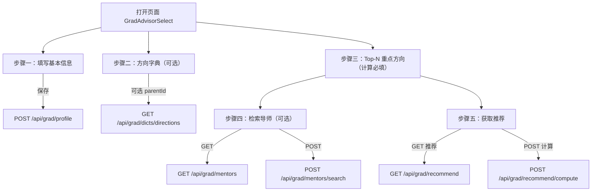

# 前端子模块：研究生择导组件（Graduate Advisor Selection UI）

本文件记录研究生择导模块（前端）的需求、流程、接口使用、组件结构与测试记录，遵循“单任务会话、数据库先行、流程图与接口文档驱动”的规范。

- 组件路径：`frontend/src/components/GradAdvisorSelect.vue`
- API 封装：`frontend/src/api/grad.ts`
- 运行方式：在 `frontend/` 执行 `npm install && npm run dev`，代理 `/api` 到 `http://localhost:8080`

## 1. 需求范围（本前端子模块）
- 学生画像录入/更新与加载
- 导师检索（GET/POST）
- 推荐结果查询与计算（GET/POST）
- 方向字典查询
- 暂不含志愿清单管理（后续阶段）

## 2. 页面与交互流程（V1）


### 2.1 会话初始化与限流联调（新增）
- 页面加载时调用 `POST /api/grad/session/init`，获得 `{ userId, sessionId }`；随后所有 `/api/grad/**` 请求自动携带 `X-Session-Id` 头。
- 若返回 429（限流）：前端读取 `Retry-After`，提示“请求频繁，请 X 秒后重试”，并对按钮做倒计时禁用（当前实现为顶部黄条 + 前端计时）。
- 用户ID：默认采用后端生成的 `userId` 自动填入，降低用户输入成本。

## 3. 接口清单（前端调用映射）
- 学生画像
  - `saveProfile(body)` → POST `/api/grad/profile`
  - `getProfile(userId)` → GET `/api/grad/profile?userId=`
- 导师检索
  - `listMentors(params)` → GET `/api/grad/mentors?universityId=&directionId=&region=&title=&keyword=&page=&size=`
  - `searchMentors(body)` → POST `/api/grad/mentors/search`
  - `deleteMentor(mentorId)` → DELETE `/api/grad/mentors/{id}`（仅测试异常提示用，UI未做删除按钮）
- 推荐
  - `getRecommend(userId,page,size)` → GET `/api/grad/recommend?userId=&page=&size=`
  - `computeRecommend({userId,page,size})` → POST `/api/grad/recommend/compute`
- 字典
  - `listDirections(parentId?)` → GET `/api/grad/dicts/directions?parentId=`（省略参数=全量）
  - `refreshDictCache()` → POST `/api/grad/dicts/refresh`（管理员/开发模式可见）
- 会话
  - `initSession()` → POST `/api/grad/session/init`，响应 `data.sessionId` 用于后续请求头 `X-Session-Id`

统一返回约定：`{ status: 'ok'|'unfit'|'error', code?, message?, data }`

## 4. 主要 DTO（前端）
- `GradProfileSaveRequest`：与后端 `ProfileSaveRequest` 对齐，字符串型 JSON 字段保持为字符串（兼容后端示例）
- `MentorDTO`：`{ id, name, title?, email?, homepage?, brief? }`
- `RecommendItemDTO`：`{ mentorId, mentorName, score, status, reasons[] }`
- `DirectionDTO`：`{ id, name, parentId? }`

## 5. 组件结构与状态（含新增要求）
- 表单区：学生画像（必要字段：`userId`）
- 字典区：加载全部或按 `parentId` 过滤；新增“刷新字典缓存”（管理员可见）
- 导师检索区：支持 GET 查询与 POST 搜索
- 推荐区：GET 拉取与 POST 计算两种入口，展示 `score/status/reasons`
- 状态提示：各区块提供简要 `message/status` 提示

Top‑N 重点方向（计算必填）
- UI 文案：由“可选”改为“计算必填”。
- 交互：
  - 必填校验：无 Top‑N 时阻止“查看推荐/重新计算推荐”，高亮并滚动至 Top‑N 区，提示“请至少选择一个研究方向”。
  - 去重校验：不允许重复方向。存在重复时禁用“确认 Top‑N 方向”，推荐操作同样被阻止并提示“存在重复的研究方向，请修改后再计算”。
  - 确认按钮：新增“确认 Top‑N 方向”按钮，点击后将选择写入 `profile.targetDirectionsTopn`（JSON）。
  - 删除规则：仅剩一行时不允许删除，并显示“至少保留一条”。

用户标识（userId）
- 已通过 `/api/grad/session/init` 自动生成与下发，并在前端隐藏，不再展示或输入。
- 所有后续 `/api/grad/**` 请求自动携带 `X-Session-Id`，无需用户干预。

## 6. 高级设置（仅管理员可见，先文档约定，后续接入用户管理）
为便于“表驱动”的域关键字与方向映射更新后快速生效，前端提供一个“刷新字典缓存”的按钮，调用后端缓存刷新端点。当前项目尚未实现用户管理，本功能先按约定仅在开发/管理员模式下显示。

- 按钮位置：推荐结果页右上角“更多/高级设置”下拉内，或单独在页面底部以链接形式展示。
- 按钮文案：`刷新字典缓存`
- 调用接口：
  - Method: POST
  - URL: `/api/grad/dicts/refresh`
  - Body: 空
  - 成功：返回 `{ status: "ok" }`，前端 toast 提示“缓存已刷新”。
  - 失败：显示错误信息（统一 ApiResponse.error）。
- 显隐策略（暂定）：
  - 仅在 `import.meta.env.DEV === true` 或 `VITE_ADMIN_MODE === 'true'` 时显示。
  - 后续接入用户管理后，按角色 `ADMIN` 控制显示。
- 伪代码示例：
```ts
// api/grad.ts
export async function refreshDictCache() {
  return http.post('/api/grad/dicts/refresh');
}

// components/GradAdvisorSelect.vue (伪代码)
<template>
  <div v-if="isAdminMode">
    <Button size="small" @click="onRefreshCache">刷新字典缓存</Button>
  </div>
  <!-- 其他内容 -->
  <Message v-if="tip">
    注意：刷新后新配置会立即生效；若看不到变化，请重新计算推荐
  </Message>
  <!-- 推荐列表 -->
</template>

<script setup lang="ts">
import { refreshDictCache } from '@/api/grad';
const isAdminMode = import.meta.env.DEV || import.meta.env.VITE_ADMIN_MODE === 'true';
async function onRefreshCache(){
  try { await refreshDictCache();
    // show success toast
  } catch(e) { /* show error */ }
}
</script>
```

提示：运维/研发在新增 `grad_major_domain_map` / `grad_direction_domain_map` 数据后，可通过该按钮手动刷新缓存，避免重启后端。

## 7. 手工测试用例
- 正常用例
  - 保存画像（示例值含 `userId=10001`, `englishType=CET6`, `englishScore=550`）→ 返回 `status=ok`
  - GET 推荐 `userId=10001&page=0&size=10` → 列表按 `score` 降序，含 `status`
  - 导师 GET 列表：`universityId=1&keyword=AI&page=0&size=10` → 返回包含“张伟”示例（依赖后端 Mock/种子数据）
  - 字典：加载全部与按 `parentId=101` 均有结果
- 边界用例
  - 非法分页：`page=-1,size=0` → 期望 status=error（后端全局异常处理器输出）
  - 画像不存在：`getProfile(999999)` → 期望 status=unfit
  - Top‑N 为空：点击推荐被阻止，高亮 Top‑N 并提示“请至少选择一个研究方向”
  - Top‑N 重复：点击“确认 Top‑N 方向”被禁用/推荐被阻止，提示“存在重复的研究方向，请修改后再计算”
  - 限流 429：提示“请求频繁，请 X 秒后重试”，按钮进入倒计时禁用
- 异常用例
  - `computeRecommend` 缺失 `userId` → 返回 `status=error`

## 7. 与后端对齐与注意事项
- 所有请求遵循后端文档与测试约定，特别是推荐接口 GET 与 POST 的路径：
  - GET `/api/grad/recommend`
  - POST `/api/grad/recommend/compute`
- `preferredDirections/targetUniversities/targetDirectionsTopn` 在 V1 以字符串形式传递 JSON，完全对齐后端文档示例。
- 统一响应结构：前端对 `status` 做轻度提示，不在 UI 层做复杂分支逻辑。

## 8. 运行与调试
1) 启动后端服务（端口 8080），确保 `/api` 路由可访问。
2) `cd frontend && npm install && npm run dev`
3) 浏览器访问 `http://localhost:5173/`，页面中“研究生择导”板块进行测试。

## 9. 本轮测试日志（摘要）
- 保存画像：`ok`
- GET 推荐：能获取列表，含 `fit/borderline` 等 `status`
- 导师检索：按 `universityId=1, keyword=AI` 返回含示例导师
- 字典：全量与 `parentId=101` 结果均正常
 - Session：`/api/grad/session/init` 正常返回，后续请求携带 `X-Session-Id`
 - RateLimit：触发 429 后显示倒计时提示，恢复后正常

## 10. 后续计划
- 志愿清单 UI（添加/查看/删除）与前端本地校验
- 推荐列表排序/筛选/分页组件化
- 更丰富的导师详情展示（方向、论文、名额、标签）
