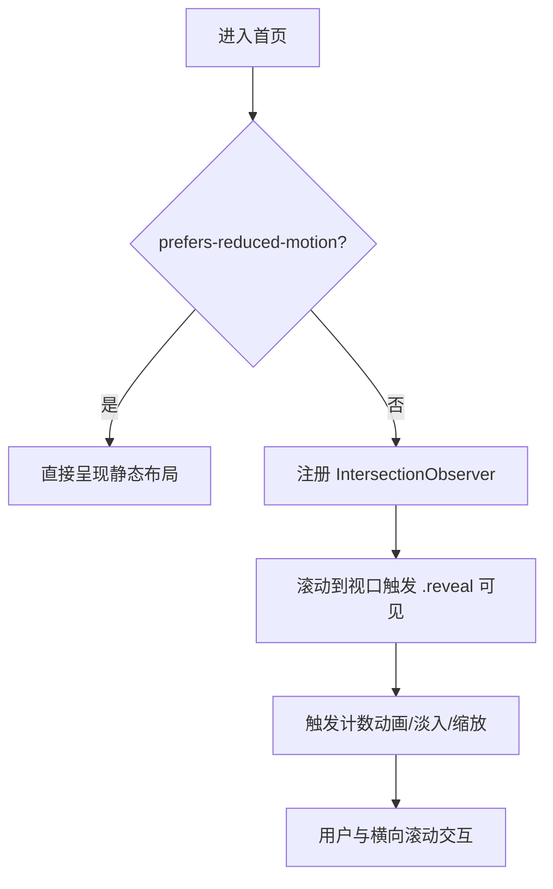

# 前端子模块：首页 UI 与交互增强

更新时间：2025-09-27

## 1. 子模块概述
本子模块聚焦系统首页（`frontend/src/pages/Home.vue`）的现代化学术风格 UI/UX 强化：
- 导航收缩与胶囊高亮、页面过渡动效（`frontend/src/App.vue`, `frontend/src/styles/theme.css`）
- 首页信息架构重排：英雄区、热门专业方向、学校一览、数据概览、研究洞察、我们的原则
- 横向滚动大卡（热门专业/高校一览），滚动入场与可达性（prefers-reduced-motion）

## 2. 需求清单
- 热门专业方向：横向滚动卡片，展示图片、名称、描述、学校数量、趋势图标
- 高校一览：16:9 长方形卡片，文字优先，悬停显示学校图片；点击卡片进站内检索，点击“查看学校”外链官网
- 数据概览：计数动画（高校数/导师数/最近更新）
- 研究洞察：左右交错的正方形图片 + 文案，滚动切入
- 动效遵循系统无障碍：开启“减少动画”时降级为静态

## 3. 流程图（展示层进入流程）


## 4. 关键实现点
- 文件：
  - `frontend/src/pages/Home.vue`
    - 新增区块：热门专业方向、学校一览、数据概览、研究洞察
    - `subjects` 与 `universities` 数据示例，含图片与外链字段
    - 计数动画与滚动观察器
  - `frontend/src/styles/theme.css`
    - 导航胶囊、标题条、卡片、过渡与阴影体系
  - `frontend/src/App.vue`
    - 头部收缩与页面过渡
- 可替换数据入口：
  - 热门专业图片：`subjects[*].bg`
  - 高校卡片：`universities[*]` 的 `name/loc/url/img`
- 可配置比例：
  - 高校卡片：`.univ-card { aspect-ratio: 16 / 9 }`
  - 研究洞察图片：`.slice-img { aspect-ratio: 1 / 1 }`

## 5. 接口与数据
- 本子模块不新增后端接口；所有数据为前端占位示例。
- 站内跳转：`/school?keyword=<高校名>`（建议后续在 School 页面自动读取并触发检索）。

## 6. 动效与可达性
- 使用 `IntersectionObserver` 控制 `.reveal`/`.reveal-zoom` 切入
- 当 `prefers-reduced-motion: reduce` 为真时：直接展示终态，不执行动画

## 7. 测试用例（手工）
- 正常：
  - 打开首页，滚动到“数据概览”，数字从 0 增至 120+/900+
  - 热门专业：可横向滚动，卡片图片显示完整；无左右按钮
  - 高校一览：鼠标悬停显示背景图；点击“查看学校”在新标签打开官网；点击卡片空白跳转到 `/school?keyword=...`
  - 研究洞察：正方形图片/文案左右交错，滚动切入
- 边界：
  - 系统开启“减少动画”，页面无入场动效，布局正常
  - 小屏下横向滚动流畅，卡片不重叠
- 异常：
  - 图片加载失败时仍显示卡片框架与文字，不影响交互

## 8. 测试步骤与命令
```bash
# 进入前端目录
npm --prefix frontend install
npm --prefix frontend run dev
# 浏览器访问 http://localhost:5173/
```

## 9. 变更清单（摘要）
- `Home.vue`：新增/调整区块与数据、滚动与计数逻辑、可达性处理
- `App.vue`：头部收缩、过渡
- `theme.css`：标题条、胶囊按钮、卡片阴影与动效

## 10. 异常记录
- 早期高校卡片 hover 上移导致“叠加”观感：已移除 `transform: translateY(-2px)`
- 研究洞察图片未显示：移除过度 transform 干扰，使用 `background-image: var(--bg)` 方式并在模板内注入 URL
- 集成电路卡片背景图链接失效：更换为可用链接

## 11. 后续计划
- School 页面读取 `keyword` 自动触发检索
- 热门专业“查看详情”跳转至对应检索/专题页面
- 图片与数据接入后端或 CMS 管理
